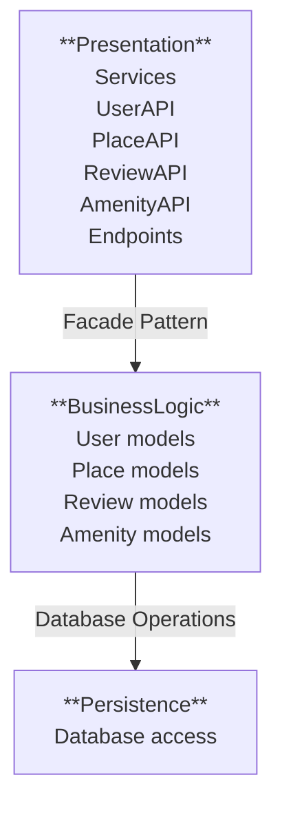
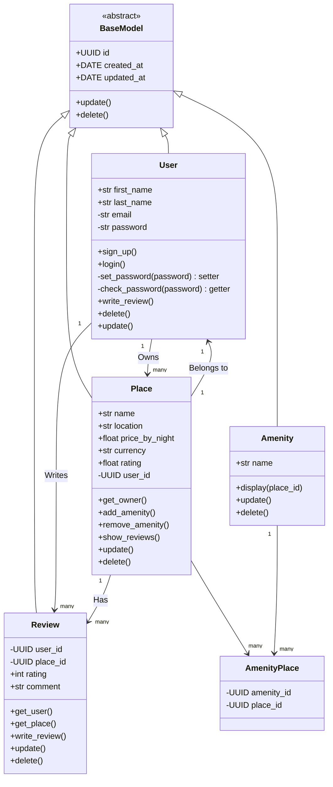
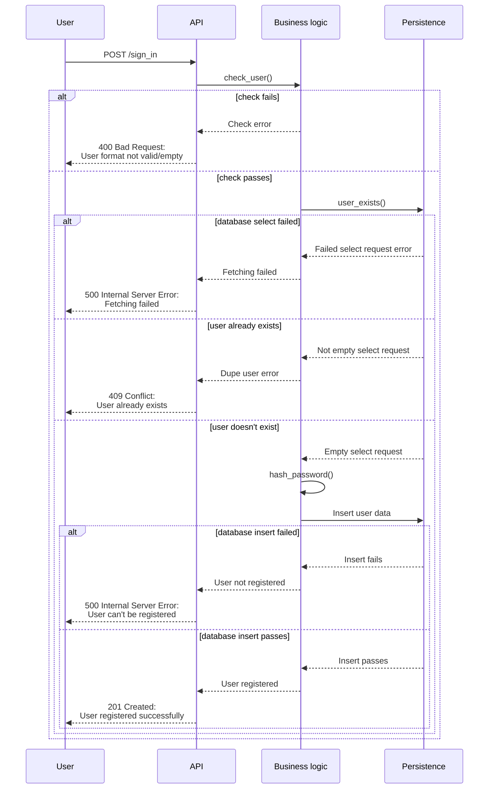
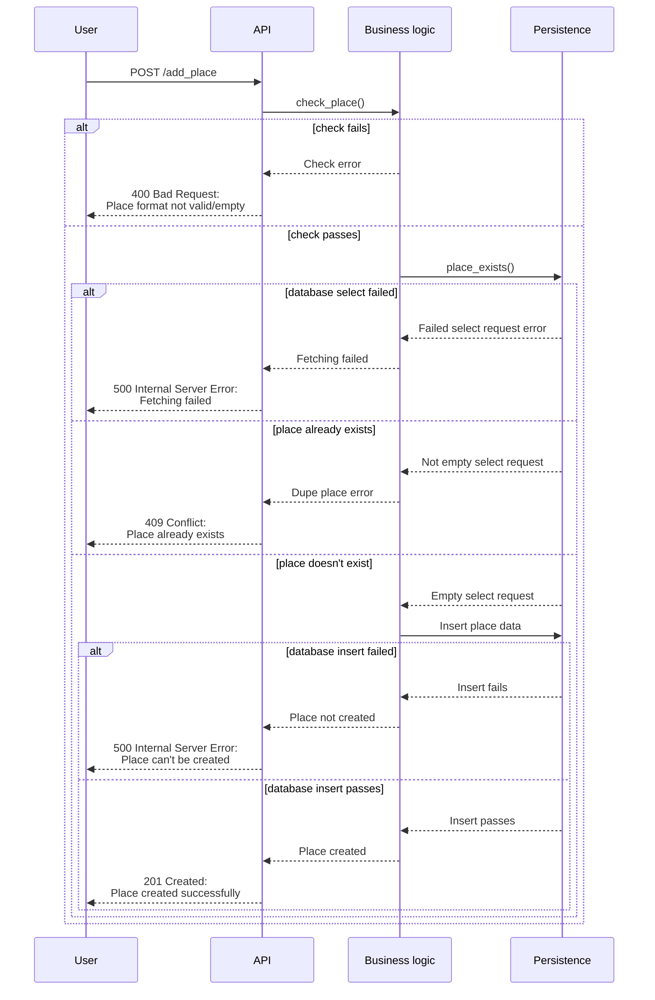
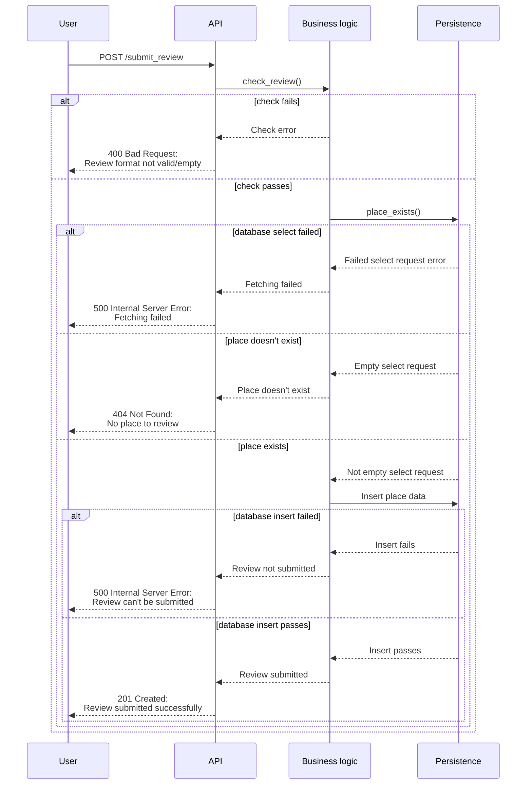
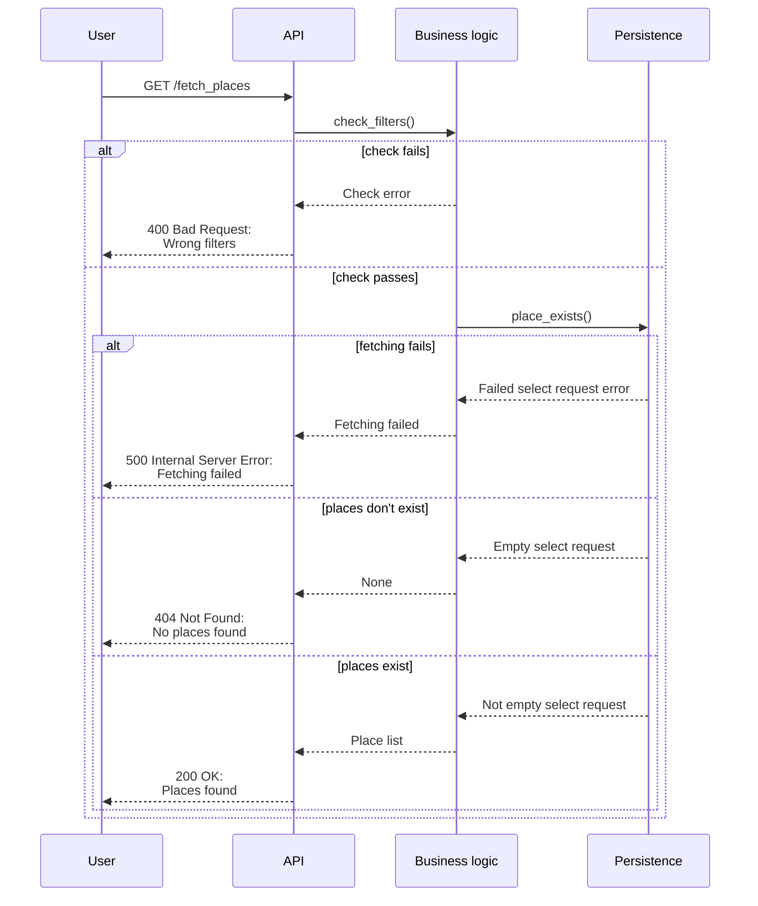

# HBnB Part 1 - UML
## 0. High-Level Package Diagram
This high-level package illustrates the three-layer architecture of the HBnB application and the communication between several layers :

The API services (Presentation layer) process the website user's actions and connects with the website's logic models (BusinessLogic layer) via the facade pattern, which in turn process objects to manage and access the website's database (Persistence Layer).

## 1. Detailed Class Diagram for Business Logic Layer

This diagram illustrates the core business entities of the HBnB application: User, Place, Review, and Amenity. Each inherits from BaseModel, which defines shared attributes like id, created_at, and updated_at.

Key relationships are shown:

A User can own multiple Places and write multiple Reviews.

A Place belongs to one User, can have many Reviews, and is linked to multiple Amenitys through AmenityPlace.

Reviews connect a User to a Place.

Amenitys can be linked to many Places.

## 2. Sequence Diagrams for API Calls
These sequence diagrams showcase the detailed process of the requests of the APIs, the logic models as well as the database responses, upon user requests.

### 2-0. User Registration
This sequence diagram correspond to a `POST` request sent by the admin or an anonymous user on the `sign_in/` endpoint route. It checks if the input is correct (especially not empty fields) and if the new user doesn't exist already.

### 2-1. Place Creation
This sequence diagram correspond to a `POST` request sent by the admin or an anonymous user on the `add_place/` endpoint route. It checks if the input is correct (especially not empty fields) and if the place doesn't correspond to an already existing place.

### 2-2. Review Submission
This sequence diagram correspond to a `POST` request sent by the admin or an anonymous user on the `submit_review/` endpoint route. It checks if the input is correct (especially if the review may be empty or may contained bad wording) and if the place the review is submitted on exists.

A user still can post the same review over and over (no spam management) and post a review on a place not visited.

### 2-3. Fetching a List of Places
This sequence diagram correspond to a `GET` request sent by the admin or an anonymous user on the `fetch_places/` endpoint route. It checks if the filters are correct, or if the search result isn't empty.

