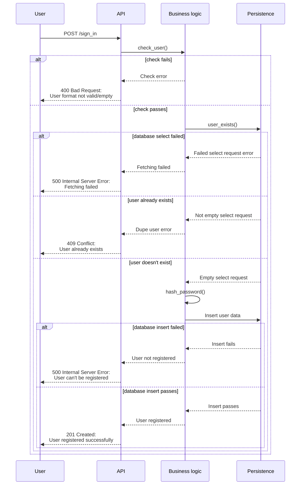

```mermaid
sequenceDiagram
    participant User
    participant API
    participant Business logic
    participant Persistence

    User->>API: POST /sign_in
    API->>Business logic: check_user()
    alt check fails
        Business logic-->>API: Check error
        API-->>User: 400 Bad Request:<br>User format not valid/empty
    else check passes
        Business logic->>Persistence: user_exists()
        alt database select failed
            Persistence-->>Business logic: Failed select request error
            Business logic-->>API: Fetching failed
            API-->>User: 500 Internal Server Error:<br>Fetching failed
        else user already exists
            Persistence-->>Business logic: Not empty select request
            Business logic-->>API: Dupe user error
            API-->>User: 409 Conflict:<br>User already exists
        else user doesn't exist
            Persistence-->>Business logic: Empty select request
            Business logic->>Business logic: hash_password()
            Business logic->>Persistence: Insert user data
            alt database insert failed
                Persistence-->>Business logic: Insert fails
                Business logic-->>API: User not registered
                API-->>User: 500 Internal Server Error:<br>User can't be registered
            else database insert passes
                Persistence-->>Business logic: Insert passes
                Business logic-->>API: User registered
                API-->>User: 201 Created:<br>User registered successfully
            end
        end
    end
```