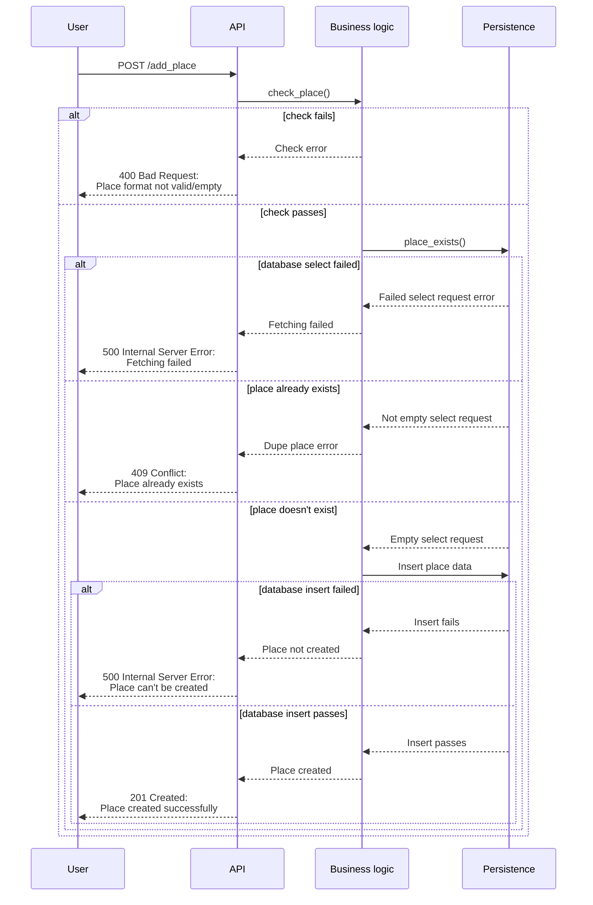

```mermaid
sequenceDiagram
    participant User
    participant API
    participant Business logic
    participant Persistence

    User->>API: POST /add_place
    API->>Business logic: check_place()
    alt check fails
        Business logic-->>API: Check error
        API-->>User: 400 Bad Request:<br>Place format not valid/empty
    else check passes
        Business logic->>Persistence: place_exists()
        alt database select failed
            Persistence-->>Business logic: Failed select request error
            Business logic-->>API: Fetching failed
            API-->>User: 500 Internal Server Error:<br>Fetching failed
        else place already exists
            Persistence-->>Business logic: Not empty select request
            Business logic-->>API: Dupe place error
            API-->>User: 409 Conflict:<br>Place already exists
        else place doesn't exist
            Persistence-->>Business logic: Empty select request
            Business logic->>Persistence: Insert place data
            alt database insert failed
                Persistence-->>Business logic: Insert fails
                Business logic-->>API: Place not created
                API-->>User: 500 Internal Server Error:<br>Place can't be created
            else database insert passes
                Persistence-->>Business logic: Insert passes
                Business logic-->>API: Place created
                API-->>User: 201 Created:<br>Place created successfully
            end
        end
    end
```