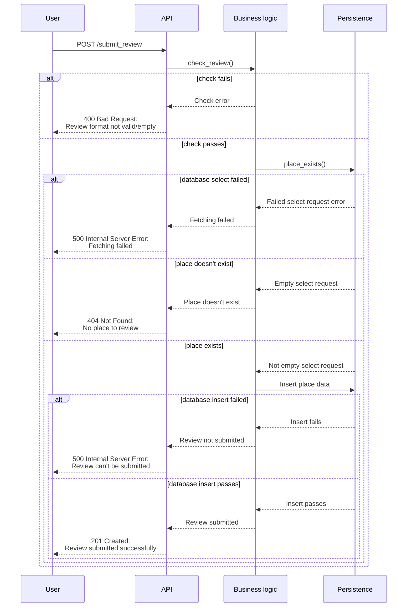

```mermaid
sequenceDiagram
    participant User
    participant API
    participant Business logic
    participant Persistence

    User->>API: POST /submit_review
    API->>Business logic: check_review()
    alt check fails
        Business logic-->>API: Check error
        API-->>User: 400 Bad Request:<br>Review format not valid/empty
    else check passes
        Business logic->>Persistence: place_exists()
        alt database select failed
            Persistence-->>Business logic: Failed select request error
            Business logic-->>API: Fetching failed
            API-->>User: 500 Internal Server Error:<br>Fetching failed
        else place doesn't exist
            Persistence-->>Business logic: Empty select request
            Business logic-->>API: Place doesn't exist
            API-->>User: 404 Not Found:<br>No place to review
        else place exists
            Persistence-->>Business logic: Not empty select request
            Business logic->>Persistence: Insert place data
            alt database insert failed
                Persistence-->>Business logic: Insert fails
                Business logic-->>API: Review not submitted
                API-->>User: 500 Internal Server Error:<br>Review can't be submitted
            else database insert passes
                Persistence-->>Business logic: Insert passes
                Business logic-->>API: Review submitted
                API-->>User: 201 Created:<br>Review submitted successfully
            end
        end
    end
```