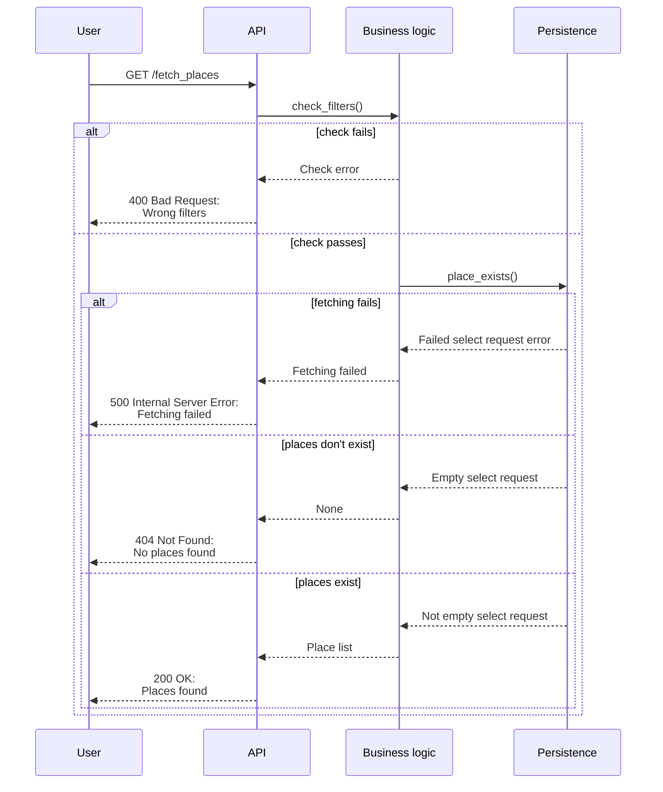

```mermaid
sequenceDiagram
    participant User
    participant API
    participant Business logic
    participant Persistence

    User->>API: GET /fetch_places
    API->>Business logic: check_filters()
    alt check fails
        Business logic-->>API: Check error
        API-->>User: 400 Bad Request:<br>Wrong filters
    else check passes
        Business logic->>Persistence: place_exists()
        alt fetching fails
            Persistence-->>Business logic: Failed select request error
            Business logic-->>API: Fetching failed
            API-->>User: 500 Internal Server Error:<br>Fetching failed
        else places don't exist
            Persistence-->>Business logic: Empty select request
            Business logic-->>API: None
            API-->>User: 404 Not Found:<br>No places found
        else places exist
            Persistence-->>Business logic: Not empty select request
            Business logic-->>API: Place list
            API-->>User: 200 OK:<br>Places found
        end
    end
```